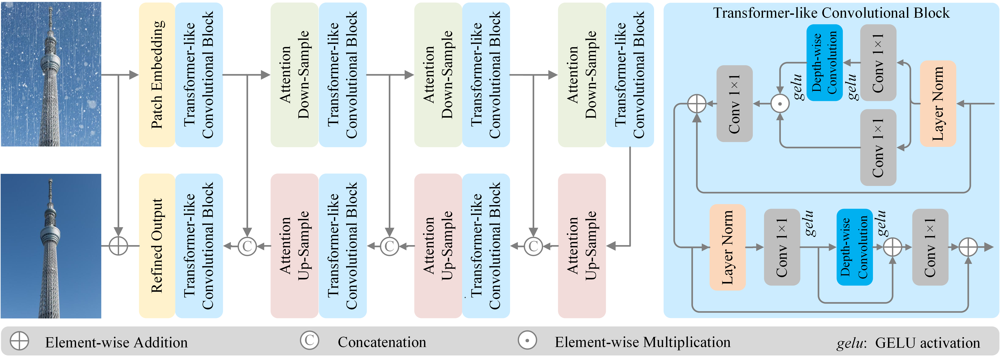

### Restoring Vision in Rain-by-snow Weather with Simple Attention-based Sampling Cross-hierarchy Transformer

[](https://arxiv.org/abs/2304.02860)   [](https://github.com/chdwyb/SASCFormer)

> **Abstract**: As an unnoticed specialized task in image restoration, rain-by-snow weather removal aims to eliminate the complicated coexisting rain streaks and snow particles. In this work, we propose a simple attention-based sampling cross-hierarchy Transformer (SASCFormer). Initially, we explore the proximity of convolution network and Transformer in hierarchical architectures and experimentally find they perform approximately for intra-stage feature representation. On this basis, we utilize a Transformer-like convolution block (TCB) to replace the computation-heavy self-attention while preserving the attention characteristics for adapting to the input content. Meanwhile, we demonstrate that cross-stage sampling progression is critical for the performance improvement in rain-by-snow weather removal, and propose a global-local self-attention sampling mechanism (GLSASM) that samples the features while preserving both the global and local dependencies.  Finally, we synthesize two novel rain-by-snow weather-degraded benchmarks, RSCityscapes and RS100K datasets.
> Extensive experiments verify that our proposed SASCFormer achieves the best trade-off between the performance and inference time. In particular, our approach advances existing methods by $1.14\ {\rm dB}\sim 4.89\ {\rm dB}$ in peak signal-to-noise ratio.



**Dependencies**

```python
python  3.8
pillow  10.0.1
torch  1.9.0
torchvision  0.10.0
tqdm  4.66.1
opencv-python  4.5.2.54
scikit-image  0.19.3
thop  0.1.1
```

**Datasets**

| Dataset      | Download Link                                                |
|--------------| ------------------------------------------------------------ |
| RSCityscapes | [[Google Drive](https://drive.google.com/file/d/1OnpsBl7-6hH6AjZPcKvuBj4qC7KvgkIy/view?usp=sharing)]     [[Baidu Cloud](https://pan.baidu.com/s/1Vh3PRk7igaWsJjEg1ZamaQ) code: olu5] |
| RS100K       | [[Baidu Cloud](https://pan.baidu.com/s/1h74tJy5VBZaAN6whGVQIhA?) code: ixul] |
| RS300        | [[Google Drive](https://drive.google.com/file/d/12hMgdTLPRCc6X_GETtTQP0rnqM5Y9Tn8/view?usp=sharing)]     [[Baidu Cloud](https://pan.baidu.com/s/11Q8iAg2yQ32PEJX-u3iphw?pwd=ozyw) code: ozyw] |

**Quick Test**

If you want to test rain-by-snow weather removal, you may download the pre-trained model of RSCityscapes dataset here, link: [[Google Drive](https://drive.google.com/file/d/1TQ0axqqWvCjKHDIRXu6LAiz55ZDxB7Wa/view?usp=sharing)] [[Baidu Cloud](https://pan.baidu.com/s/1TkK0IWdUAPuB1HZ802BxWw?pwd=0blh) code: 0blh]. If you want to test image desnowing, you may download the pre-trained model of Snow100K dataset here, link: [[Google Drive](https://drive.google.com/file/d/17fG4-P09ltIYroxKz6-Fo1wZXY5las5h/view?usp=sharing)] [[Baidu Cloud](https://pan.baidu.com/s/1C9_mxgvcwEeR9AIIDX1iUw?pwd=5qop) code: 5qop]. 

We provide a `demo.py` for you to have a quick test on one degraded image. Once you have downloaded the pre-trained models of our proposed SASCFormer, you may conduct quick test following the example usage below.

```python
python demo.py --image_path ./RainCityscapes/test/input/0001.png --result_path ./RSCityscapes/test/result/0001.png --resume_state ./models/RSCityscapes.pth --pad_factor 16 --result_save True --cuda True --num_works 4
```

**Train**

We provide the training code in the `train.py` file for training our proposed SASCFormer. You should first download our synthesized two rain-by-snow weather-degraded datasets.

The RSCityscapes and RS100K datasets follow the form below.

```
|--RSCityscapes
    |--train
        |--input  
            |--image 1
            |--image 2
            : 
            |--image n
        |--target  
            |--image 1
            |--image 2
            :
            |--image n
    |--test 
        |--input  
            |--image 1
            |--image 2
            :  
            |--image m
        |--target  
            |--image 1
            |--image 2
            : 
            |--image m
```

Once you have downloaded the datasets, you may utilize the following example usage to conduct training.

```python
python train.py --seed 1234 --epoch 200 --batch_size_train 32 --batch_size_val 32 --patch_size_train 256 --patch_size_val 256 --lr 2e-4 --lr_min 1e-7 --train_data ./RSCityscapes/train --val_data ./RSCityscapes/val --resume_state ./model_resume.pth --save_state ./model_best.pth --cuda True --val_frequency 3 --loss_weight 0.04 --autocast True --num_works 4
```

**Test**

To evaluate our SASCFormer on your own datasets or our provided datasets, you may utilize the following example usage to conduct experiments.

```python
python test.py --val_data ./RSCityscapes/test --result_dir ./RSCityscapes/test/result/ --resume_state ./models/RSCityscapes.pth --pad_factor 16 --result_save True --cuda True --only_last True --num_works 4
```

**Acknowledgement**

We are sincerely grateful to the work of [DesnowNet](https://github.com/linYDTHU/DesnowNet_Context-Aware_Deep_Network_for_Snow_Removal), [PReNet](https://github.com/csdwren/PReNet), [MPRNet](https://github.com/swz30/MPRNet), [Uformer](https://github.com/ZhendongWang6/Uformer), [TransWeather](https://github.com/jeya-maria-jose/TransWeather), [SnowFormer](https://github.com/Ephemeral182/SnowFormer), [Restormer](https://github.com/swz30/Restormer). If you find our work helpful for your research, we kindly request that you cite our work and these studies when referencing them.

**Contact**

If you have any questions about our work, you may contact us at wyb@chd.edu.cn.

